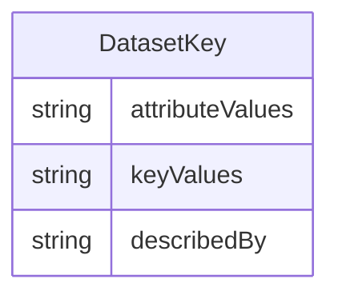

---
search:
  boost: 10.0
---

# Class: DatasetKey 


_An abstract identifier that comprises the cross-product of dimension values to identify a specific cross-section_


<div data-search-exclude markdown="1">


* __NOTE__: this is an abstract class and should not be instantiated directly


URI: [dds:class/DatasetKey](https://cdisc.org/ddsclass/DatasetKey)





## Inheritance
* **DatasetKey**
    * [GroupKey](../classes/GroupKey.md)
    * [SeriesKey](../classes/SeriesKey.md)


## Slots

| Name | Cardinality and Range | Description | Inheritance |
| ---  | --- | --- | --- |
| [describedBy](../slots/describedBy.md) | 0..1 <br/> [String](../types/String.md)&nbsp;or&nbsp;<br />[Dimension](../classes/Dimension.md)&nbsp;or&nbsp;<br />[ComponentList](../classes/ComponentList.md) | Associates the Dimension Descriptor defined in the Data Structure Definition | direct |
| [keyValues](../slots/keyValues.md) | 0..1 <br/> [String](../types/String.md) | List of Key Values that comprise each key, separated by a dot e.g. SUBJ001.VISIT2.BMI | direct |
| [attributeValues](../slots/attributeValues.md) | 0..1 <br/> [String](../types/String.md) | Association to the Attribute Values relating to Key | direct |


## Identifier and Mapping Information


### Schema Source


* from schema: https://cdisc.org/dds


## Mappings

| Mapping Type | Mapped Value |
| ---  | ---  |
| self | dds:DatasetKey |
| native | dds:DatasetKey |
| exact | sdmx:Key |


## LinkML Source

<!-- TODO: investigate https://stackoverflow.com/questions/37606292/how-to-create-tabbed-code-blocks-in-mkdocs-or-sphinx -->

### Direct

<details>
```yaml
name: DatasetKey
description: An abstract identifier that comprises the cross-product of dimension
  values to identify a specific cross-section
from_schema: https://cdisc.org/dds
exact_mappings:
- sdmx:Key
abstract: true
attributes:
  describedBy:
    name: describedBy
    description: Associates the Dimension Descriptor defined in the Data Structure
      Definition
    from_schema: https://cdisc.org/dds
    domain_of:
    - Dataset
    - DatasetKey
    any_of:
    - range: Dimension
    - range: ComponentList
  keyValues:
    name: keyValues
    description: List of Key Values that comprise each key, separated by a dot e.g.
      SUBJ001.VISIT2.BMI
    from_schema: https://cdisc.org/dds
    rank: 1000
    domain_of:
    - DatasetKey
  attributeValues:
    name: attributeValues
    description: Association to the Attribute Values relating to Key
    from_schema: https://cdisc.org/dds
    rank: 1000
    domain_of:
    - DatasetKey

```
</details>

### Induced

<details>
```yaml
name: DatasetKey
description: An abstract identifier that comprises the cross-product of dimension
  values to identify a specific cross-section
from_schema: https://cdisc.org/dds
exact_mappings:
- sdmx:Key
abstract: true
attributes:
  describedBy:
    name: describedBy
    description: Associates the Dimension Descriptor defined in the Data Structure
      Definition
    from_schema: https://cdisc.org/dds
    owner: DatasetKey
    domain_of:
    - Dataset
    - DatasetKey
    range: string
    any_of:
    - range: Dimension
    - range: ComponentList
  keyValues:
    name: keyValues
    description: List of Key Values that comprise each key, separated by a dot e.g.
      SUBJ001.VISIT2.BMI
    from_schema: https://cdisc.org/dds
    rank: 1000
    owner: DatasetKey
    domain_of:
    - DatasetKey
    range: string
  attributeValues:
    name: attributeValues
    description: Association to the Attribute Values relating to Key
    from_schema: https://cdisc.org/dds
    rank: 1000
    owner: DatasetKey
    domain_of:
    - DatasetKey
    range: string

```
</details></div>