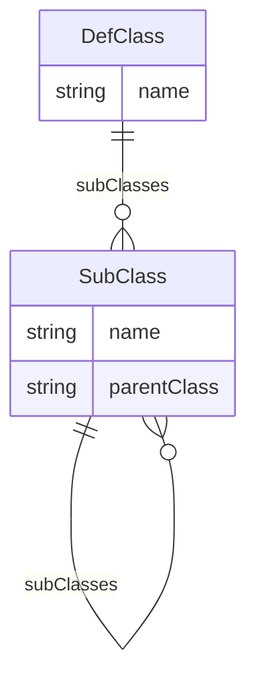

---
search:
  boost: 10.0
---

# Class: DefClass 


_The predefined CDISC model Class that applies to an ItemGroupDef._


<div data-search-exclude markdown="1">


URI: [dds:class/DefClass](https://cdisc.org/ddsclass/DefClass)





<!-- no inheritance hierarchy -->

## Slots

| Name | Cardinality and Range | Description | Inheritance |
| ---  | --- | --- | --- |
| [name](../slots/name.md) | 1 <br/> [String](../types/String.md) | Name of the General Observation Class following CDISC Controlled Terminology. | direct |
| [subClasses](../slots/subClasses.md) | * <br/> [SubClass](../classes/SubClass.md) | One or more SubClasses that further identify the specific SubClass within a Class. | direct |


## Usages

| used by | used in | type | used |
| ---  | --- | --- | --- |
| [ItemGroup](../classes/ItemGroup.md) | [observationClass](../slots/observationClass.md) | range | [DefClass](../classes/DefClass.md) |
| [DataStructureDefinition](../classes/DataStructureDefinition.md) | [observationClass](../slots/observationClass.md) | range | [DefClass](../classes/DefClass.md) |


## Identifier and Mapping Information


### Schema Source


* from schema: https://cdisc.org/dds


## Mappings

| Mapping Type | Mapped Value |
| ---  | ---  |
| self | dds:DefClass |
| native | dds:DefClass |


## LinkML Source

<!-- TODO: investigate https://stackoverflow.com/questions/37606292/how-to-create-tabbed-code-blocks-in-mkdocs-or-sphinx -->

### Direct

<details>
```yaml
name: DefClass
description: The predefined CDISC model Class that applies to an ItemGroupDef.
from_schema: https://cdisc.org/dds
attributes:
  name:
    name: name
    description: Name of the General Observation Class following CDISC Controlled
      Terminology.
    from_schema: https://cdisc.org/dds
    domain_of:
    - Labelled
    - DefClass
    - SubClass
    - Standard
    required: true
  subClasses:
    name: subClasses
    description: One or more SubClasses that further identify the specific SubClass
      within a Class.
    from_schema: https://cdisc.org/dds
    rank: 1000
    domain_of:
    - DefClass
    - SubClass
    range: SubClass
    required: false
    multivalued: true
    inlined: true
    inlined_as_list: true

```
</details>

### Induced

<details>
```yaml
name: DefClass
description: The predefined CDISC model Class that applies to an ItemGroupDef.
from_schema: https://cdisc.org/dds
attributes:
  name:
    name: name
    description: Name of the General Observation Class following CDISC Controlled
      Terminology.
    from_schema: https://cdisc.org/dds
    owner: DefClass
    domain_of:
    - Labelled
    - DefClass
    - SubClass
    - Standard
    range: string
    required: true
  subClasses:
    name: subClasses
    description: One or more SubClasses that further identify the specific SubClass
      within a Class.
    from_schema: https://cdisc.org/dds
    rank: 1000
    owner: DefClass
    domain_of:
    - DefClass
    - SubClass
    range: SubClass
    required: false
    multivalued: true
    inlined: true
    inlined_as_list: true

```
</details></div>