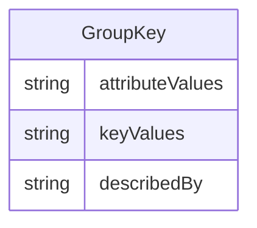

---
search:
  boost: 10.0
---

# Class: GroupKey 


_A dimension subset that represents collections of dimensions that are subsets of the full dimension set, distinct from SeriesKey which includes Time dimensions_


<div data-search-exclude markdown="1">


URI: [odm:class/GroupKey](https://cdisc.org/odm2/class/GroupKey)





## Inheritance
* [DatasetKey](../classes/DatasetKey.md)
    * **GroupKey**


## Slots

| Name | Cardinality and Range | Description | Inheritance |
| ---  | --- | --- | --- |
| [describedBy](../slots/describedBy.md) | 0..1 <br/> [String](../types/String.md)&nbsp;or&nbsp;<br />[Dimension](../classes/Dimension.md)&nbsp;or&nbsp;<br />[ComponentList](../classes/ComponentList.md) | Associates the Dimension Descriptor defined in the Data Structure Definition | [DatasetKey](../classes/DatasetKey.md) |
| [keyValues](../slots/keyValues.md) | 0..1 <br/> [String](../types/String.md) | List of Key Values that comprise each key, separated by a dot e.g. SUBJ001.VISIT2.BMI | [DatasetKey](../classes/DatasetKey.md) |
| [attributeValues](../slots/attributeValues.md) | 0..1 <br/> [String](../types/String.md) | Association to the Attribute Values relating to Key | [DatasetKey](../classes/DatasetKey.md) |


## Usages

| used by | used in | type | used |
| ---  | --- | --- | --- |
| [Dataset](../classes/Dataset.md) | [keys](../slots/keys.md) | any_of[range] | [GroupKey](../classes/GroupKey.md) |


## Identifier and Mapping Information


### Schema Source


* from schema: https://cdisc.org/define-json


## Mappings

| Mapping Type | Mapped Value |
| ---  | ---  |
| self | odm:GroupKey |
| native | odm:GroupKey |
| exact | sdmx:GroupKey |


## LinkML Source

<!-- TODO: investigate https://stackoverflow.com/questions/37606292/how-to-create-tabbed-code-blocks-in-mkdocs-or-sphinx -->

### Direct

<details>
```yaml
name: GroupKey
description: A dimension subset that represents collections of dimensions that are
  subsets of the full dimension set, distinct from SeriesKey which includes Time dimensions
from_schema: https://cdisc.org/define-json
exact_mappings:
- sdmx:GroupKey
is_a: DatasetKey

```
</details>

### Induced

<details>
```yaml
name: GroupKey
description: A dimension subset that represents collections of dimensions that are
  subsets of the full dimension set, distinct from SeriesKey which includes Time dimensions
from_schema: https://cdisc.org/define-json
exact_mappings:
- sdmx:GroupKey
is_a: DatasetKey
attributes:
  describedBy:
    name: describedBy
    description: Associates the Dimension Descriptor defined in the Data Structure
      Definition
    from_schema: https://cdisc.org/define-json
    owner: GroupKey
    domain_of:
    - Dataset
    - DatasetKey
    range: string
    any_of:
    - range: Dimension
    - range: ComponentList
  keyValues:
    name: keyValues
    description: List of Key Values that comprise each key, separated by a dot e.g.
      SUBJ001.VISIT2.BMI
    from_schema: https://cdisc.org/define-json
    rank: 1000
    owner: GroupKey
    domain_of:
    - DatasetKey
    range: string
  attributeValues:
    name: attributeValues
    description: Association to the Attribute Values relating to Key
    from_schema: https://cdisc.org/define-json
    rank: 1000
    owner: GroupKey
    domain_of:
    - DatasetKey
    range: string

```
</details></div>