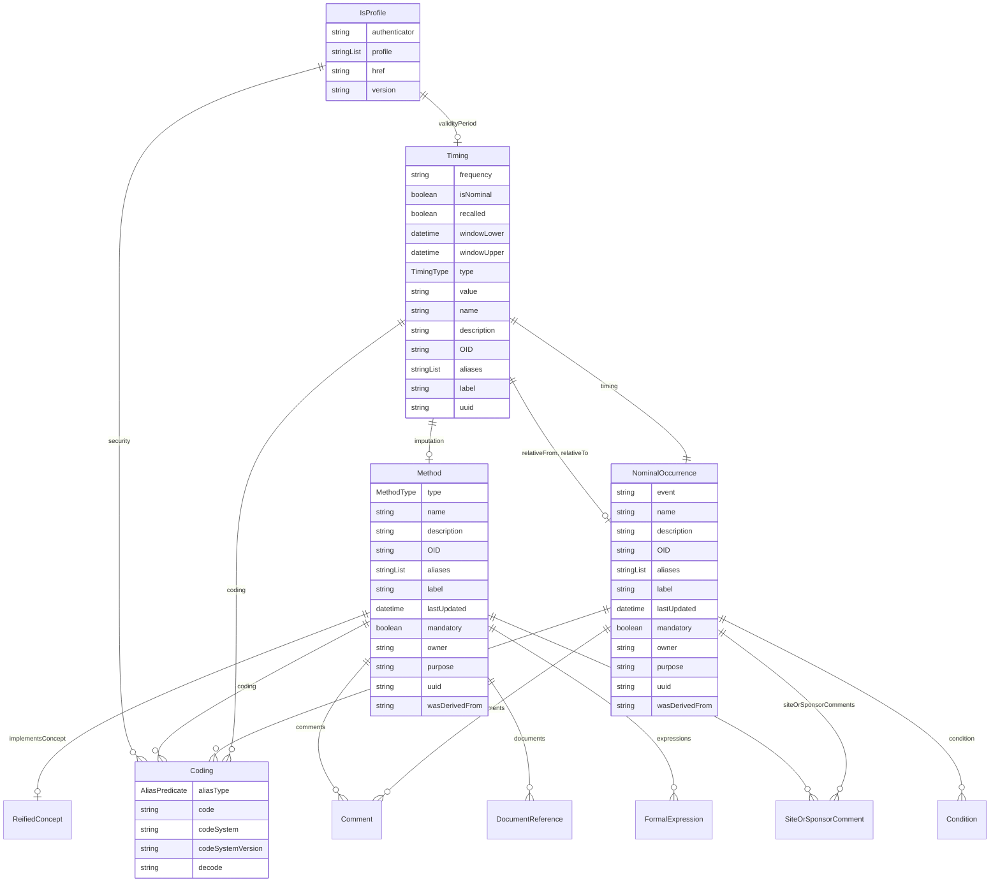

---
search:
  boost: 10.0
---

# Class: IsProfile 


_A mixin that provides additional metadata for FHIR resources and Data Products, including profiles, security tags, and validity periods_


<div data-search-exclude markdown="1">


URI: [dds:class/IsProfile](https://cdisc.org/ddsclass/IsProfile)





## Inheritance
* **IsProfile** [ [Versioned](../classes/Versioned.md)]


## Class Properties

| Property | Value |
| --- | --- |
| Mixin | Yes |


## Slots

| Name | Cardinality and Range | Description | Inheritance |
| ---  | --- | --- | --- |
| [profile](../slots/profile.md) | * <br/> [String](../types/String.md) | Profiles this resource claims to conform to | direct |
| [security](../slots/security.md) | * <br/> [Coding](../classes/Coding.md) | Security tags applied to this resource | direct |
| [authenticator](../slots/authenticator.md) | 0..1 <br/> [String](../types/String.md)&nbsp;or&nbsp;<br />[User](../classes/User.md)&nbsp;or&nbsp;<br />[Organization](../classes/Organization.md) | Who/what authenticated the resource | direct |
| [validityPeriod](../slots/validityPeriod.md) | 0..1 <br/> [Timing](../classes/Timing.md) | Time period during which the resouce is valid | direct |
| [version](../slots/version.md) | 0..1 <br/> [String](../types/String.md) | The version of the external resources | [Versioned](../classes/Versioned.md) |
| [href](../slots/href.md) | 0..1 <br/> [String](../types/String.md) | Machine-readable instructions to obtain the resource e.g. FHIR path, URL | [Versioned](../classes/Versioned.md) |


## Mixin Usage

| mixed into | description |
| --- | --- |
| [ItemGroup](../classes/ItemGroup.md) | A collection element that groups related items or subgroups within a specific context, used for tables, FHIR resource profiles, biomedical concept specializations, or form sections |
| [Dataset](../classes/Dataset.md) | A collection element that groups observations sharing the same dimensionality, expressed as a set of unique dimensions within a Data Product context |


## Identifier and Mapping Information


### Schema Source


* from schema: https://cdisc.org/dds


## Mappings

| Mapping Type | Mapped Value |
| ---  | ---  |
| self | dds:IsProfile |
| native | dds:IsProfile |


## LinkML Source

<!-- TODO: investigate https://stackoverflow.com/questions/37606292/how-to-create-tabbed-code-blocks-in-mkdocs-or-sphinx -->

### Direct

<details>
```yaml
name: IsProfile
description: A mixin that provides additional metadata for FHIR resources and Data
  Products, including profiles, security tags, and validity periods
from_schema: https://cdisc.org/dds
mixin: true
mixins:
- Versioned
attributes:
  profile:
    name: profile
    description: Profiles this resource claims to conform to
    from_schema: https://cdisc.org/dds
    rank: 1000
    domain_of:
    - IsProfile
    range: string
    multivalued: true
  security:
    name: security
    description: Security tags applied to this resource
    from_schema: https://cdisc.org/dds
    rank: 1000
    domain_of:
    - IsProfile
    range: Coding
    multivalued: true
    inlined: true
    inlined_as_list: true
  authenticator:
    name: authenticator
    description: Who/what authenticated the resource
    from_schema: https://cdisc.org/dds
    rank: 1000
    domain_of:
    - IsProfile
    required: false
    any_of:
    - range: User
    - range: Organization
    - range: string
  validityPeriod:
    name: validityPeriod
    description: Time period during which the resouce is valid
    from_schema: https://cdisc.org/dds
    rank: 1000
    domain_of:
    - IsProfile
    range: Timing
    required: false

```
</details>

### Induced

<details>
```yaml
name: IsProfile
description: A mixin that provides additional metadata for FHIR resources and Data
  Products, including profiles, security tags, and validity periods
from_schema: https://cdisc.org/dds
mixin: true
mixins:
- Versioned
attributes:
  profile:
    name: profile
    description: Profiles this resource claims to conform to
    from_schema: https://cdisc.org/dds
    rank: 1000
    owner: IsProfile
    domain_of:
    - IsProfile
    range: string
    multivalued: true
  security:
    name: security
    description: Security tags applied to this resource
    from_schema: https://cdisc.org/dds
    rank: 1000
    owner: IsProfile
    domain_of:
    - IsProfile
    range: Coding
    multivalued: true
    inlined: true
    inlined_as_list: true
  authenticator:
    name: authenticator
    description: Who/what authenticated the resource
    from_schema: https://cdisc.org/dds
    rank: 1000
    owner: IsProfile
    domain_of:
    - IsProfile
    range: string
    required: false
    any_of:
    - range: User
    - range: Organization
    - range: string
  validityPeriod:
    name: validityPeriod
    description: Time period during which the resouce is valid
    from_schema: https://cdisc.org/dds
    rank: 1000
    owner: IsProfile
    domain_of:
    - IsProfile
    range: Timing
    required: false
  version:
    name: version
    description: The version of the external resources
    from_schema: https://cdisc.org/dds
    rank: 1000
    owner: IsProfile
    domain_of:
    - Versioned
    - Standard
    range: string
  href:
    name: href
    description: Machine-readable instructions to obtain the resource e.g. FHIR path,
      URL
    from_schema: https://cdisc.org/dds
    rank: 1000
    owner: IsProfile
    domain_of:
    - Versioned
    range: string
    required: false

```
</details></div>