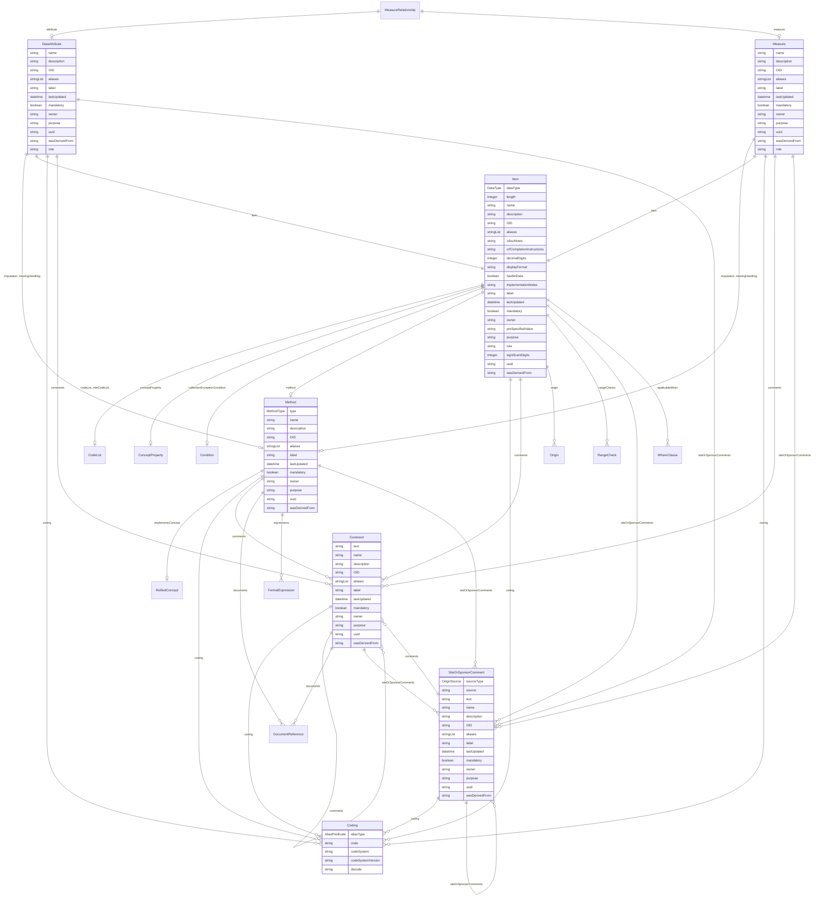

---
search:
  boost: 10.0
---

# Class: MeasureRelationship 


_A relationship element that associates a DataAttribute with a Measure_


<div data-search-exclude markdown="1">


URI: [dds:class/MeasureRelationship](https://cdisc.org/ddsclass/MeasureRelationship)





<!-- no inheritance hierarchy -->

## Slots

| Name | Cardinality and Range | Description | Inheritance |
| ---  | --- | --- | --- |
| [measure](../slots/measure.md) | 0..1 <br/> [Measure](../classes/Measure.md) |  | direct |
| [attribute](../slots/attribute.md) | 0..1 <br/> [DataAttribute](../classes/DataAttribute.md) |  | direct |


## Identifier and Mapping Information


### Schema Source


* from schema: https://cdisc.org/dds


## Mappings

| Mapping Type | Mapped Value |
| ---  | ---  |
| self | dds:MeasureRelationship |
| native | dds:MeasureRelationship |
| exact | sdmx:MeasureRelationship |


## LinkML Source

<!-- TODO: investigate https://stackoverflow.com/questions/37606292/how-to-create-tabbed-code-blocks-in-mkdocs-or-sphinx -->

### Direct

<details>
```yaml
name: MeasureRelationship
description: A relationship element that associates a DataAttribute with a Measure
from_schema: https://cdisc.org/dds
exact_mappings:
- sdmx:MeasureRelationship
attributes:
  measure:
    name: measure
    from_schema: https://cdisc.org/dds
    rank: 1000
    domain_of:
    - MeasureRelationship
    range: Measure
  attribute:
    name: attribute
    from_schema: https://cdisc.org/dds
    domain_of:
    - Resource
    - MeasureRelationship
    - DataflowRelationship
    - GroupRelationship
    - DimensionRelationship
    - ObservationRelationship
    range: DataAttribute

```
</details>

### Induced

<details>
```yaml
name: MeasureRelationship
description: A relationship element that associates a DataAttribute with a Measure
from_schema: https://cdisc.org/dds
exact_mappings:
- sdmx:MeasureRelationship
attributes:
  measure:
    name: measure
    from_schema: https://cdisc.org/dds
    rank: 1000
    owner: MeasureRelationship
    domain_of:
    - MeasureRelationship
    range: Measure
  attribute:
    name: attribute
    from_schema: https://cdisc.org/dds
    owner: MeasureRelationship
    domain_of:
    - Resource
    - MeasureRelationship
    - DataflowRelationship
    - GroupRelationship
    - DimensionRelationship
    - ObservationRelationship
    range: DataAttribute

```
</details></div>