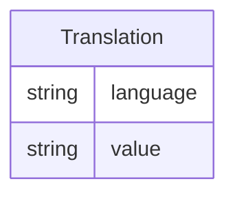

---
search:
  boost: 10.0
---

# Class: Translation 


_A text representation that provides content in a specific language, used for multilingual support_


<div data-search-exclude markdown="1">


URI: [odm:class/Translation](https://cdisc.org/odm2/class/Translation)





<!-- no inheritance hierarchy -->

## Slots

| Name | Cardinality and Range | Description | Inheritance |
| ---  | --- | --- | --- |
| [language](../slots/language.md) | 1 <br/> [String](../types/String.md) | The language of the translation | direct |
| [value](../slots/value.md) | 1 <br/> [String](../types/String.md) | The translated text | direct |


## Usages

| used by | used in | type | used |
| ---  | --- | --- | --- |
| [TranslatedText](../classes/TranslatedText.md) | [translations](../slots/translations.md) | range | [Translation](../classes/Translation.md) |


## Identifier and Mapping Information


### Schema Source


* from schema: https://cdisc.org/dds


## Mappings

| Mapping Type | Mapped Value |
| ---  | ---  |
| self | odm:Translation |
| native | odm:Translation |
| exact | odm:TranslatedText, sdmx:InternationalString |


## LinkML Source

<!-- TODO: investigate https://stackoverflow.com/questions/37606292/how-to-create-tabbed-code-blocks-in-mkdocs-or-sphinx -->

### Direct

<details>
```yaml
name: Translation
description: A text representation that provides content in a specific language, used
  for multilingual support
from_schema: https://cdisc.org/dds
exact_mappings:
- odm:TranslatedText
- sdmx:InternationalString
attributes:
  language:
    name: language
    description: The language of the translation
    from_schema: https://cdisc.org/dds
    rank: 1000
    domain_of:
    - Translation
    range: string
    required: true
  value:
    name: value
    description: The translated text
    from_schema: https://cdisc.org/dds
    rank: 1000
    domain_of:
    - Translation
    - Parameter
    - Timing
    range: string
    required: true

```
</details>

### Induced

<details>
```yaml
name: Translation
description: A text representation that provides content in a specific language, used
  for multilingual support
from_schema: https://cdisc.org/dds
exact_mappings:
- odm:TranslatedText
- sdmx:InternationalString
attributes:
  language:
    name: language
    description: The language of the translation
    from_schema: https://cdisc.org/dds
    rank: 1000
    owner: Translation
    domain_of:
    - Translation
    range: string
    required: true
  value:
    name: value
    description: The translated text
    from_schema: https://cdisc.org/dds
    rank: 1000
    owner: Translation
    domain_of:
    - Translation
    - Parameter
    - Timing
    range: string
    required: true

```
</details></div>