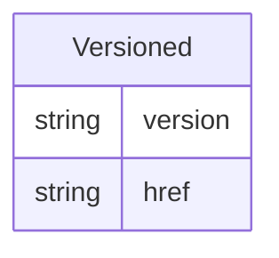

# Class: Versioned 


_A mixin that provides version and connectivity information, including version numbers and resource references_


URI: [odm:class/Versioned](https://cdisc.org/odm2/class/Versioned)





<!-- no inheritance hierarchy -->


## Slots

| Name | Cardinality and Range | Description | Inheritance |
| ---  | --- | --- | --- |
| [version](../slots/version.md) | 0..1 <br/> [String](../types/String.md) | The version of the external resources | direct |
| [href](../slots/href.md) | 0..1 <br/> [String](../types/String.md) | Machine-readable instructions to obtain the resource e.g. FHIR path, URL | direct |


## Mixin Usage

| mixed into | description |
| --- | --- |
| [IsProfile](../classes/IsProfile.md) | A mixin that provides additional metadata for FHIR resources and Data Products, including profiles, security tags, and validity periods |
| [CodeList](../classes/CodeList.md) | A value set that defines a discrete collection of permissible values for an item, corresponding to the ODM CodeList construct |
| [Dictionary](../classes/Dictionary.md) | A dictionary that defines a set of codes and their meanings |
| [ReifiedConcept](../classes/ReifiedConcept.md) | A canonical information layer that makes abstract concepts explicit and referenceable, showing how different data implementations represent the same underlying meanings through a star schema structure with multiple properties |
| [Resource](../classes/Resource.md) | An external reference that serves as the source for a Dataset, ItemGroup, or Item |
| [DocumentReference](../classes/DocumentReference.md) | A comprehensive reference element that points to an external document, combining elements from ODM and FHIR |
| [Dataflow](../classes/Dataflow.md) | An abstract representation that defines data provision for different reference periods, where a Distribution and its Dataset are instances |
| [Dataset](../classes/Dataset.md) | A collection element that groups observations sharing the same dimensionality, expressed as a set of unique dimensions within a Data Product context |
| [DataProduct](../classes/DataProduct.md) | A governed collection that represents a purpose-driven assembly of datasets and services with an owning team and lifecycle. The DataProduct defines the boundary of accountability between data producers and consumers. |
| [ProvisionAgreement](../classes/ProvisionAgreement.md) | An agreement element that describes the contractual relationship between a Data Provider and a Data Consumer regarding data provision |
| [Analysis](../classes/Analysis.md) | Analysis extends Method to capture analysis-specific metadata including the reason for analysis, its purpose, and data traceability for the results used.<br>Expressions and parameters from Method can be generic or implementation-specific. |
| [Display](../classes/Display.md) | A rendered output of an analysis result. |


## Identifier and Mapping Information


### Schema Source


* from schema: https://cdisc.org/dds


## Mappings

| Mapping Type | Mapped Value |
| ---  | ---  |
| self | odm:Versioned |
| native | odm:Versioned |


## LinkML Source

<!-- TODO: investigate https://stackoverflow.com/questions/37606292/how-to-create-tabbed-code-blocks-in-mkdocs-or-sphinx -->

### Direct

<details>
```yaml
name: Versioned
description: A mixin that provides version and connectivity information, including
  version numbers and resource references
from_schema: https://cdisc.org/dds
mixin: true
attributes:
  version:
    name: version
    description: The version of the external resources
    from_schema: https://cdisc.org/dds
    rank: 1000
    domain_of:
    - Versioned
    - Standard
    range: string
  href:
    name: href
    description: Machine-readable instructions to obtain the resource e.g. FHIR path,
      URL
    from_schema: https://cdisc.org/dds
    rank: 1000
    domain_of:
    - Versioned
    range: string
    required: false

```
</details>

### Induced

<details>
```yaml
name: Versioned
description: A mixin that provides version and connectivity information, including
  version numbers and resource references
from_schema: https://cdisc.org/dds
mixin: true
attributes:
  version:
    name: version
    description: The version of the external resources
    from_schema: https://cdisc.org/dds
    rank: 1000
    alias: version
    owner: Versioned
    domain_of:
    - Versioned
    - Standard
    range: string
  href:
    name: href
    description: Machine-readable instructions to obtain the resource e.g. FHIR path,
      URL
    from_schema: https://cdisc.org/dds
    rank: 1000
    alias: href
    owner: Versioned
    domain_of:
    - Versioned
    range: string
    required: false

```
</details>